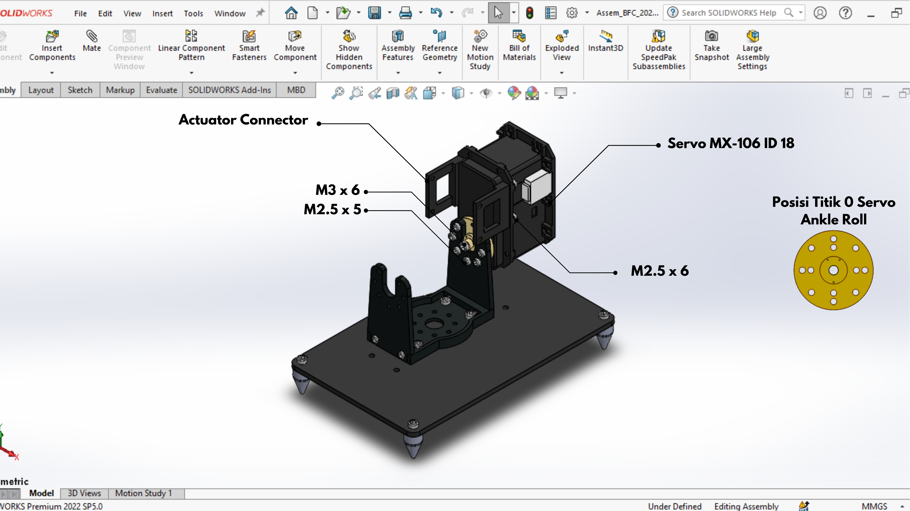
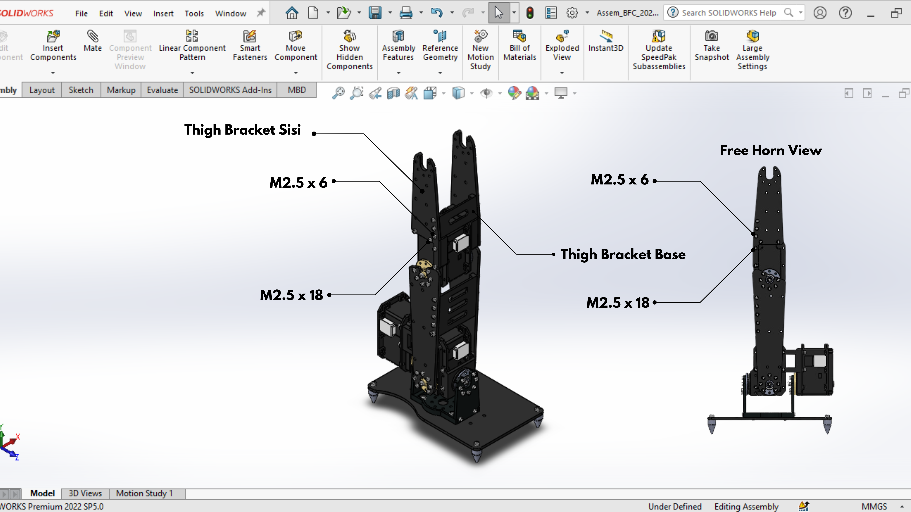
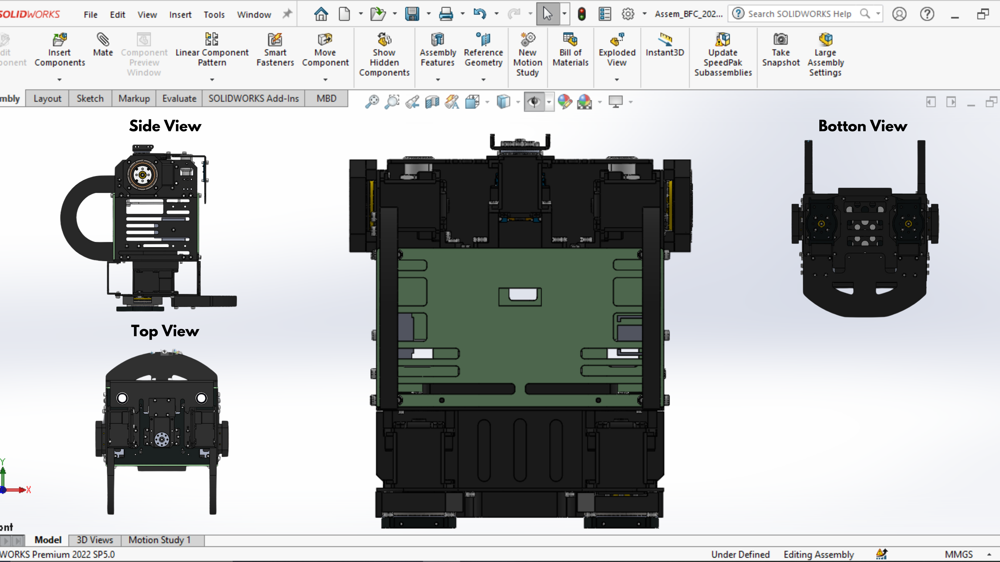
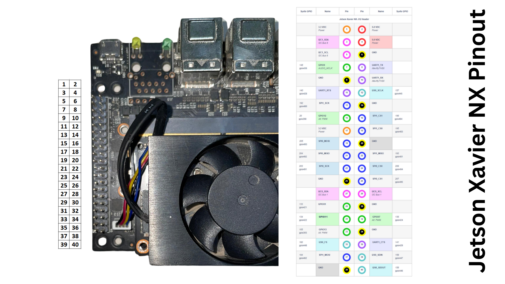

# Instalasi Hardware

## 1. Assembly Robot from Scratch

#### Design Robot BFC 2024
[Design Robot Barelang FC 2024](https://cad.onshape.com/documents/11dd52f6ac06887404d88aa4/w/51161f6c47152c3611e9607f/e/3844ed094cabe083826a32d8?renderMode=0&uiState=66e1418c1d03f44ec049fbab)

### 1. Mengetahui ID Motor Servo pada Robot
Robot Humanoid Soccer Kid Size memiliki 20 motor servo, berikut adalah urutan ID motor servo pada robot:

### 2. Assembly Kaki Robot
Berikut adalah langkah-langkah merakit robot humanoid dari awal hingga akhir:

* Langkah pertama ialah menghubungkan **Foot Step** dengan **4 Pul** menggunakan baut **M3 x 6** sebanyak 4 baut.

* Kemudian hubungkan **Hip Bracket Base** dengan **Foot Step** menggunakan 4 pcs baut **M3 x 6** dan dikunci menggunakan **4 pcs Locknut** pada masing masing baut tersebut. dianjutkan dengan menghubungkan **2 Hip Bracket** dengan **Hip Bracket Base** menggunakan **4 pcs baut M2.5 x 6** dilengkapi dengan **Loctite Thread lock** pada masing masing baut.

* kemudian siapkan **servo MX-106T ID 18**, pasang horn servo mengarah ke bawah dan kencangkan baut horn servo menggunakan baut **M3 x 6** lalu hubungkan horn servo ke bagian **Hip Brakcet** menggunakan 7 pcs baut **M2.5 x 5**. kemudian lengkapi **servo MX-106T** dengan 1 set **Actuator Connector** menggunakan baut **M2.5 x 6**.

* selanjutnya hubungkan **Bracket FR05-S101** dengan **Hip Bracket** Menggunakan 7 pcs baut **M2.5 x 5**.

* siapkan **servo MX106-T ID 16**, pasangkan horn servo menggunakan baut **M3 x 6** mengarah ke bawah bagian dalam kaki. kemudian hubungkan **servo MX-106T ID 16** dengan bagian **Bracket FR05-S101 dan 1 set Actuator Connector** menggunakan baut **M2.5 x 6** dilengkapi dengan **Nut M2.5**.

* siapkan 1 set **Knee Bracket Sisi** kemudian hubungkan pada **kedua Horn Servo MX-106T ID 16** menggunakan 14 baut **M2.5 x 5**. kemudian hubungkan 1 set **Knee Bracket Sisi** dengan **Knee Bracket Base** menggunakan 10 pcs baut **M2.5 x 6** dan **Loctite Thread Lock**.

* selanjutnya siapkan **Servo MX-106T ID 14**, Pasangkan horn servo menggunakan baut **M3 x 6** mengarah ke bawah bagian dalam kaki. kemudian hubungkan 1 set **Knee Bracket Sisi** ke Horn dan Free horn servo menggunakan 14 pcs baut **M2.5 x 5**.

* selanjutnya siapkan 1 set **Thigh Bracket Sisi** dilengkapi dengan 1 set **Join Bracket Sisi** di pasang secara bergantian ke **Servo MX-106T ID 14** menggunakan baut 8 pcs baut **M2.5 x 18**. setelah terpasang hubungkan kedua **Thigh Bracket Sisi** dengan part **Thigh Bracket Base** menggunakan baut **M2.5 x 6** dilengkapi dengan **Loctite Thread Lock**.

* siapkan **servo MX-106T ID 12**, pasangkan horn servo mengarah ke atas dan kencangkan menggunakan baut **M3 x 6**. kemudian lengkapi **servo MX-106T ID 12** dengan part **FR05-S101** menggunakan baut **M2.5 x 6** dilengkapi dengan **Nut M2.5**. lalu hubungkan **Horn servo MX-106T ID 12** dengan part **Thigh Bracket Sisi** menggunakan 14 pcs baut **M2.5 x 5**.

* selanjutnya fokus merakit **Servo MX-106T ID 10** dengan horn mengarah ke atas dan dikencangkan menggunakan baut **M3 x 6**. kemudian pada horn servo dihubungkan dengan part **Hip Bracket** menggunakan 7 baut **M2.5 x 5** dan pada servo dilengkapi dengan 1 set **Actuator Connector** yang dihubungkan dengan baut **M2.5 x 6**.

* setelah itu hubungkan **Servo MX-106T ID 12** dengan **Servo MX-106T ID 10** melalui Part **Actuator Connector dan FR05-S101** menggunakan baut **M2.5x6**.

* Hubungkan **Hip Bracket** dengan part **FR05-S101** menggunakan baut **M2.5 x 5** dan mengencangkan **Free Horn pada FR05-S101** menggunakan baut **M2.5 x 6**.

* setelah kaki kiri selesai dirakit, ulangi hal yang sama untuk merakit kaki kanan robot, perhatikan ID yang sudah tertera urutannya dan arah titik nol horn servo yang sudah disebutkan pada langkah langkah tersebut.

### 3. Assembly Body Robot
* Pertama, Hubungkan **Base Battery** dengan motor **servo MX-64 ID 7 & 8** menggunakan 8 pcs baut **M2.5 x 8**.
  
* Kemudian, Hubungkan kedua horn motor servo dengan urutan seperti di gambar, **Home Bearing** Ke Servo menggunakan 4 pcs baut **M2.5 x 6**, Kemudian**Bearing AXK2542** dan **Washer AXK 2542** untuk mengisi Gap dengan **Spacer Bearing Hip**, Kemudian kunci dengan 4 pcs baut **M2.5 x 18** dan **Locknut M2.5** .
  
* Hubungkan **Home Bearing** dengan **Ancle bracket Base** menggunakan 4 pcs baut **M2.5 x 8**. berikan **Bearing AXK 2542 & Washer AXK 2542** untuk mengisi Gap tersebut.
  
* Selanjutnya, Pasang **Battery Cover Bracket** dengan **Hip Join MX 64** ke motor servo ID 7 & 8 menggunakan 12 pcs baut **M2.5 x 18**. pada bagian depan hubungkan **Join Battery Bracket** menggunakan 4 pcs baut **M2.5 x 6** untuk menutupi bagian depan tempat battery.
  
* Kemudian berikan **Chest Bracket Base** pada permukaan battery cover bracket dengan menggunakan 4 pcs baut **M2.5 x 10 & Locknut M2.5**.
  
* Pasang **Home Base Jetson Xavier NX** ke **Chest Bracket Base** Menggunakan 4 pcs baut **M2.5 x 6**.
  
* Kemudian di area belakang pasangkan bagian **Back Switch** Ke **Chest Bracket Base** Menggunakan 2 pcs baut **M2.5 x 6**.
  
* kemudian hubungkan **Back Bumper** dengan **Back Switch** yang terhubung dengan motor **Servo ID 7 & 8** menggunakan 8 pcs baut **M2.5 x 18**.
  
* Selanjutnya, untuk menutup tempat battery. pasangkan bagian **Back Cover Battery** ke bagian **Back Switch** menggunakan 4 pcs **Klip Plastik Body Motor**.
  
* selanjutnya pada bagian samping body, pasangkan **Side Chest Bracket** ke **Chest Bracket Base** menggunakan 4 pcs baut **M2.5 x 6**. pada bagian side chest bracket pasangkan **Dioda Bridge Home** menggunakan Baut **M3 x 8**.
  
* Pada sisi lain, lakukan hal yang sama. gantikan posisi dioda bridge home dengan bagian **U2D2 Home** pada sisi **Side Chest Bracket**.
  
* setelah itu pada kedua bagian side chest bracket hubungkan dengan **Upper Chest Bracket** dengan 4 pcs baut **M2.5 x 6**.
  
* Kemudian selanjutnya pada bagian dalam body robot, hubungkan **Board OpenCR** dengan bagian **Upper Chest Bracket** dengan Menggunakan 3 pcs baut **M2.5 x 16 & Locknut**.
  
* Pada bagian atas upper chest bracket berikan sepasang **Angled Actuator Servo Holder** pada sisi kanan dan kiri menggunakan 6 pcs baut **M2.5 x 8**.
  
* selanjutnya pasangkan bagian **Chest Actuator Connector** ke upper chest bracket menggunakan 6 pcs baut **M2.5 x 8**.
  
* selanjutnya pasangkan **Servo ID 1** pada sisi kanan yang dihubungkan dengan **Angled Actuator Connector** menggunakan 3 pcs Baut **M2.5 x 8**. lengkapi pada bagian sisi servo dengan bagian **Upper side Chest** dihubungkan menggunakan 9 pcs baut **M2.5 x 8**
  
* Lakukan hal yang sama pada sisi kiri menggunakan **servo MX-64 ID 2**.
  
* selanjutnya pasang motor **servo MX-28 ID 19** dengan **Chest Actuator Connector** menggunakan 4 pcs baut **M2.5 x 6**
  
* pada bagian depan, pasangkan part **Front Bumper** dengan **Upper Side Chest** bagian dalam dan **Side Chest Bracket** bagian luar menggunakan 8 pcs Baut **M2.5 x 16**.
  
* selanjutnya, hubungkan **Button & Oled Base** ke motor **Servo MX-28 ID 19** dengan menggunakan **Engsel** dan 4 pcs baut **M2.5 x 8 dan Locknut**.
  
* pada bagian belakang, tutup body robot dengan part **Backdoor Robot** menggunakan 4 pcs baut **M2.5 x 8**.
  
* Dan pada bagian depan, tutup body robot dengan part **Frontdoor Robot** menggunakan 4 pcs baut **M2.5 x 8**
  
* selanjutnya pada kedua sisi badan, hubungkan sesuai urutan gambar. **Home Bearing** ke Horn Servo menggunakan 4 pcs baut M2.5 x 8, **Hand Bearing Holder & Spacer Hand Bearing** ke **Upper Side Chest** menggunakan 4 pcs baut M2.5 x 18
  
* Terakhir berikan part **FR07-S101** ke Horn servo ID 19 menggunakan 8 pcs Baut M2 x 5.
  
* Maka hasil akhir pada step Assembly Body Robot akan seperti gambar berikut.
  
   
### 4. Assembly Tangan Robot
* Hubungkan Part **Hand Derlin** ke part **Hand Join** menggunkan 6 pcs baut **M2.5 x 8 dan Locknut**.
  
* Kemudian, hubungkan part **Hand Join dengan** dengan part **FR05 Hand Join** Menggunakan 4 pcs baut **M2.5 x 8 & Locknut**.
  
* Hubungkan **servo ID 6** dengan part **FR05 Hand Join** menggunakan 4 pcs baut **M2.5 x 8**.
  
* kemudian pada horn servo dipasangkan part **Angled Actuator Bracket Side** menggunakan 7 pcs baut **M2.5 x 5**.
  
* Hubungkan kedua **Angled Actuator Bracket Side** dengan part **Angled Actuator Bracket Base** menggunakan 6 pcs baut **M2.5 x 8**.
  
* Kemudian, memasang part **Join Hand Side** pada kedua sisi part **Angled Actuator Bracket Base** dengan menggunakan 6 pcs baut **M2.5 x 8**. selanjutnya diantara **Join Hand Side** dipasangkan part **Join Hand Base** menggunakan 12 pcs baut **M2.5 x 8**.
  
* Kemudian hubungkan motor **Servo MX-64 ID 4** dengan part **Join Hand Side** menggunakan 4 pcs baut **M2.5 x 8**.
  
* Pada kedua horn servo hubungkan dengan **Angled Actuator Bracket Side** menggunakan 14 pcs baut **M2.5 x 5**.
  
* diantara kedua Angled Actuator Bracket Side hubungkan dengan part **Angled Actuator Bracket Base** menggunakan 6 pcs baut **M2.5 x 8**.
  
* Terakhir pada sisi luar servo MX-64 ID 4 diberikan part **Bumper Side** dengan menggunakan 6 pcs baut **M2.5 x 8**.
  
* Lakukan Hal yang sama seperti langkah langkah sebelumnya, maka hasil akhir dari Assembly Tangan Robot akan seperti pada gambar berikut.
  
   
### 5. Assembly Kepala Robot
* Siapkan motor **Servo MX-28 ID 20** kemudian pasangkan salah satu sisi horn dengan **Cam Bracket Sisi** menggunakan 5 pcs baut **M2 x 5**.
  
* Siapkan **Camera Econ** kemudian hubungkan dengan part **Cam Bracket Base** menggunakan 4 pcs baut **M2 x 6**.
  
* Setelah itu hubungkan **Cam Bracket Base** dengan **Cam Bracket Sisi** dan pasangkan **Cam Bracket Sisi** pada sisi horn lain untuk mengunci **cam bracket base** menggunakan 5 pcs baut **M2 x 5**.
  
* Selanjutnya berikan **Head Bracket Base** pada sisi atas **Camera Econ** menggunakan 4 pcs baut **M2 x 6**.
  
* Pada salah satu sisi berikan part **Head Bracket Sisi** untuk menghubungkan part **Cam Bracket Sisi** dengan part **Head** menggunakan 3 pcs Baut **M2.5 x 16**.
  
* Setelah itu hubungkan part **Lens Protection** dan **Head Cover** dengan part **Head** menggunakan 2 pcs baut **M2.5 x 8**.
  
* Terakhir memasang part **Head Bracket sisi** pada sisi lain untuk mengunci part **Lens Protection** dan kunci ke part **Head Cover** menggunakan 2 pcs baut **M2.5 x 8**, maka hasil akhir dari Assembly Kepala Robot akan seperti gambar berikut.
  
   
### 6. Assembly Robot
* Setelah Assembly Kaki dan Badan Selesai, maka Hubungkan part **Hip Bracket Sisi** dengan **Ancle Bracket Base** menggunakan 4 pcs baut **M2.5 x 8** dan Loctite Thread Lock. lakukan pada kedua sisi kaki
  
* Setelah Assembly Tangan dan Body Selesai, maka hubungkan part **Home Bearing** dengan part **Angled Actuator Bracket Base** menggunakan 4 pcs baut **M2.5 x 8** dan Loctite Thread Lock.
  
* Setelah itu pada bagian Assembly Kepala dan Assembly Body robot, hubungkan part **FR07-S101** dengan **Servo MX-28 ID 20** Menggunakan 4 pcs Baut **M2.5 x8** dan **Nut M2.5**.
  
* Maka tampilan akhir Assembly keseluruhan robot Humanoid Soccer Kid Size Barelang FC akan seperti gambar berikut
  
  
## 2. Wiring Electrical Robot

TODO: Senta & Kayla
NOTES: Dilengkapi semua gambar rangkaian electrical
### Pinout Jetson Xavier NX

Source: https://jetsonhacks.com/nvidia-jetson-xavier-nx-gpio-header-pinout/

### Pinout OpenCr

### Jetson Wiring Connections

### OpenCr Wiring Connections

#### 1. Wiring Diagram Robot
#### 2. Servo Cable List
#### 6. Servo Connection