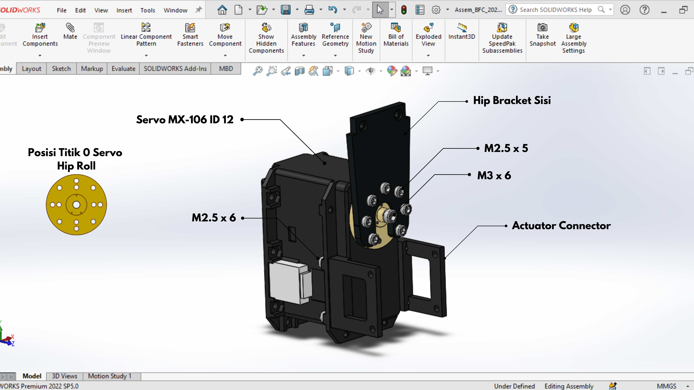

# Instalasi Hardware

## 1. Assembly Robot from Scratch

#### Design Robot BFC 2024
[Design Robot Barelang FC 2024](https://cad.onshape.com/documents/11dd52f6ac06887404d88aa4/w/51161f6c47152c3611e9607f/e/3844ed094cabe083826a32d8?renderMode=0&uiState=66e1418c1d03f44ec049fbab)

### 1. Mengetahui ID Motor Servo pada Robot
Robot Humanoid Soccer Kid Size memiliki 20 motor servo, berikut adalah urutan ID motor servo pada robot:

### 2. Assembly Robot
Berikut adalah langkah-langkah merakit robot humanoid dari awal hingga akhir:

* Langkah pertama ialah menghubungkan **Foot Step** dengan **4 Pul** menggunakan baut **M3 x 6** sebanyak 4 baut.

* Kemudian hubungkan **Hip Bracket Base** dengan **Foot Step** menggunakan 4 pcs baut **M3 x 6** dan dikunci menggunakan **4 pcs Locknut** pada masing masing baut tersebut. dianjutkan dengan menghubungkan **2 Hip Bracket** dengan **Hip Bracket Base** menggunakan **4 pcs baut M2.5 x 6** dilengkapi dengan **Loctite Thread lock** pada masing masing baut.

* kemudian siapkan **servo MX-106T ID 18**, pasang horn servo mengarah ke bawah dan kencangkan baut horn servo menggunakan baut **M3 x 6** lalu hubungkan horn servo ke bagian **Hip Brakcet** menggunakan 7 pcs baut **M2.5 x 5**. kemudian lengkapi **servo MX-106T** dengan 1 set **Actuator Connector** menggunakan baut **M2.5 x 6**.

* selanjutnya hubungkan **Bracket FR05-S101** dengan **Hip Bracket** Menggunakan 7 pcs baut **M2.5 x 5**.

* siapkan **servo MX106-T ID 16**, pasangkan horn servo menggunakan baut **M3 x 6** mengarah ke bawah bagian dalam kaki. kemudian hubungkan **servo MX-106T ID 16** dengan bagian **Bracket FR05-S101 dan 1 set Actuator Connector** menggunakan baut **M2.5 x 6** dilengkapi dengan **Nut M2.5**.

* siapkan 1 set **Knee Bracket Sisi** kemudian hubungkan pada **kedua Horn Servo MX-106T ID 16** menggunakan 14 baut **M2.5 x 5**. kemudian hubungkan 1 set **Knee Bracket Sisi** dengan **Knee Bracket Base** menggunakan 10 pcs baut **M2.5 x 6** dan **Loctite Thread Lock**.

* selanjutnya siapkan **Servo MX-106T ID 14**, Pasangkan horn servo menggunakan baut **M3 x 6** mengarah ke bawah bagian dalam kaki. kemudian hubungkan 1 set **Knee Bracket Sisi** ke Horn dan Free horn servo menggunakan 14 pcs baut **M2.5 x 5**.

* selanjutnya siapkan 1 set **Thigh Bracket Sisi** dilengkapi dengan 1 set **Join Bracket Sisi** di pasang secara bergantian ke **Servo MX-106T ID 14** menggunakan baut 8 pcs baut **M2.5 x 18**. setelah terpasang hubungkan kedua **Thigh Bracket Sisi** dengan part **Thigh Bracket Base** menggunakan baut **M2.5 x 6** dilengkapi dengan **Loctite Thread Lock**.

* siapkan **servo MX-106T ID 12**, pasangkan horn servo mengarah ke atas dan kencangkan menggunakan baut **M3 x 6**. kemudian lengkapi **servo MX-106T ID 12** dengan part **FR05-S101** menggunakan baut **M2.5 x 6** dilengkapi dengan **Nut M2.5**. lalu hubungkan **Horn servo MX-106T ID 12** dengan part **Thigh Bracket Sisi** menggunakan 14 pcs baut **M2.5 x 5**.

* selanjutnya fokus merakit **Servo MX-106T ID 10** dengan horn mengarah ke atas dan dikencangkan menggunakan baut **M3 x 6**. kemudian pada horn servo dihubungkan dengan part **Hip Bracket** menggunakan 7 baut **M2.5 x 5** dan pada servo dilengkapi dengan 1 set **Actuator Connector** yang dihubungkan dengan baut **M2.5 x 6**.

* setelah itu hubungkan **Servo MX-106T ID 12** dengan **Servo MX-106T ID 10** melalui Part **Actuator Connector dan FR05-S101** menggunakan baut **M2.5x6**.

* Hubungkan **Hip Bracket** dengan part **FR05-S101** menggunakan baut **M2.5 x 5** dan mengencangkan **Free Horn pada FR05-S101** menggunakan baut **M2.5 x 6**.

* setelah kaki kiri selesai dirakit, ulangi hal yang sama untuk merakit kaki kanan robot, perhatikan ID yang sudah tertera urutannya dan arah titik nol horn servo yang sudah disebutkan pada langkah langkah tersebut.

## 2. Wiring Electrical Robot

TODO: Senta & Kayla
NOTES: Dilengkapi semua gambar rangkaian electrical
### Pinout Jetson Xavier NX

Source: https://jetsonhacks.com/nvidia-jetson-xavier-nx-gpio-header-pinout/

### Pinout OpenCr

### OpenCr Wiring Connections

#### 1. Wiring Diagram Robot
#### 2. Servo Cable List
#### 6. Servo Connection