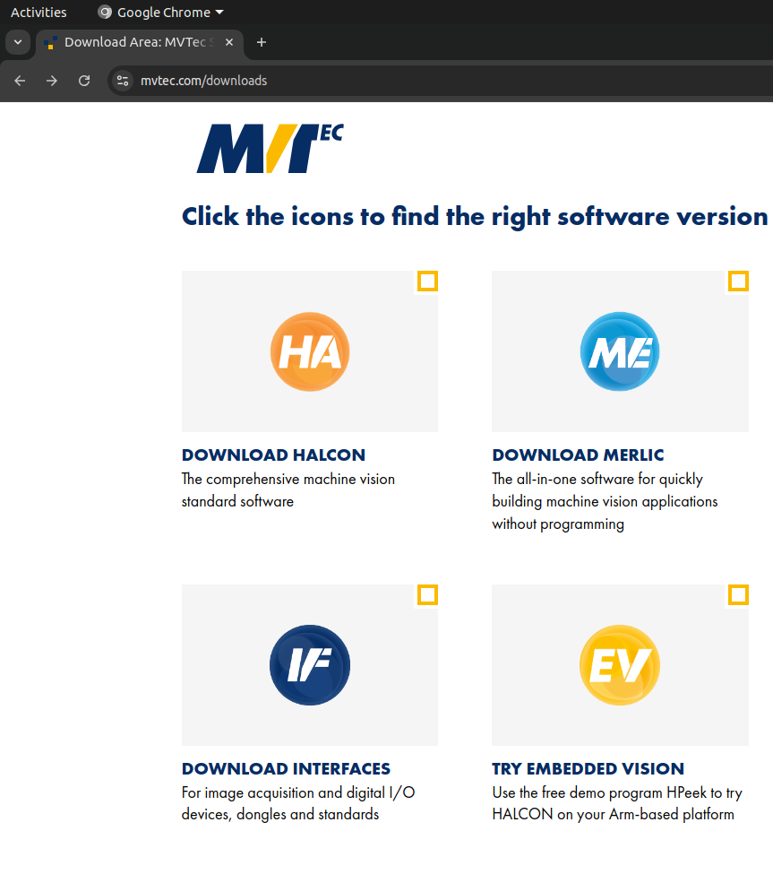
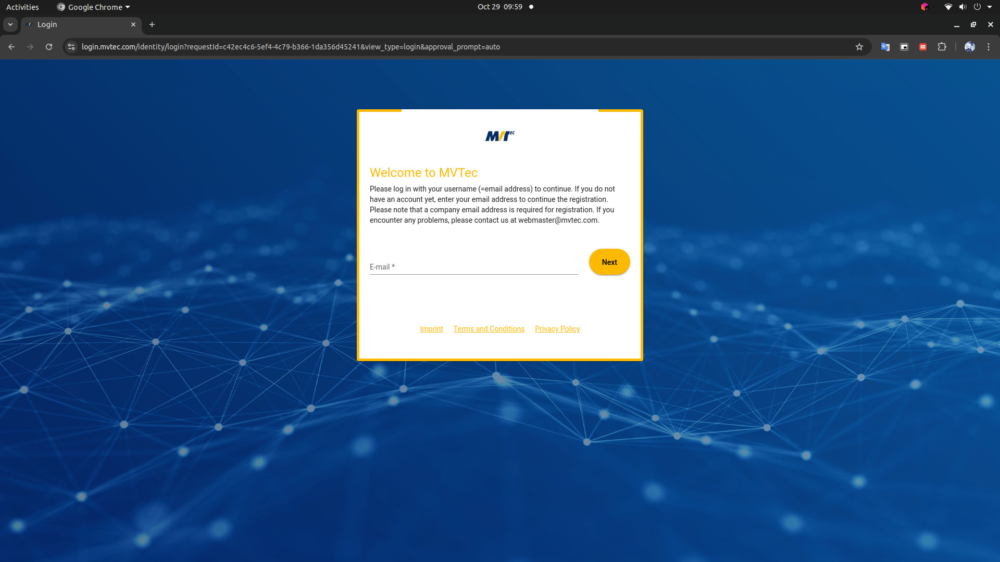

# Server Setup

Dokumentasi terkait instalasi software pada komputer server.

## 1. Instalasi Ubuntu

TODO: Zaky
NOTES: Lengkap dengan dokumentasi gambar

## 2. Instalasi CUDA dan NVIDIA Toolkit

TODO: Zaky

## 3. Instalasi Darknet

TODO: Zaky

## 4. Instalasi CVAT

TODO: Zaky

## 5. Instalasi HALCON Software
Buka browser pilihan anda, disarankan untuk memakai browser chrome agar lebih mudah. Lalu pergi ke link instalasi [halcon](https://www.mvtec.com/downloads).
Anda akan menemukan tampilan seperti di bawah ini.

Anda perlu mengklik bagian *download halcon*. Akan tetapi, anda juga perlu menginstall *deep learning tool* jika ingin menganotasi gambar di *halcon software*. 
Setelah itu anda perlu login akun ke dalam web Halcon. Jika anda tidak memilikinya, maka anda bisa registrasi terlebih dahul. Mohon pastikan bahwa akun email yang akan anda pakai adalah akun resmi suatu lembaga atau perusahaan, bukan mili pribadi.

Selanjutnya anda perlu memilih jenis platform dan versi halcon yang diinginkan. Pilihlah sesuai device yang sedang atau akan anda gunakan.

Jika anda sudah mendownload halcon, maka anda bisa mencari berkas file nya di direktori downloads. 

Anda ekstrak berkas tersebut dan masuk kedalam foldernya.

Kemudian anda buka terminal anda jika anda berada di linux, lalu ketikkan perintah seperti gambar di bawah ini.

Jika anda berada di windows atau MacOS, maka anda perlu membuka aplikasi SOM.

Tampilan dari som akan membuka browser pilihan secara otomatis.

Kemudian, tekan tanda titik tiga sebelah atas kanan, lalu pilih manage packages. Lalu pilih ALL.

Jika sudah, maka tekan apply dan file akan terinstall di device anda. Folder utama berada di direktori home.

Untuk menjalankan software halcon, anda harus memiliki file licensi yang terdapat di direktori ./license pada folder halcon. Jika sudah anda bisa menjalankan software halcon lewat terminal dengan perintah ./hdevelop.

Tampilan jendela dari halcon software akan seperti ini.

Jangan lupa anda berikan pengaturan environtment pada .bashrc jika anda menjalankan aplikasi ini di linux.

Untuk penggunaan di embedded system, halcon tidak bisa dijalankan dengan perintah ./hdevelop, melainkan harus dijalankan dengan perintah ./hrun alamat file serta file. Sebagai contoh ada di gambar berikut.

Untuk manual book bisa diliat di link [ini](https://drive.google.com/drive/folders/1u7xizRHurcoYx97DMh4Sz7V3gZ5-cOQv?usp=sharing).

## 6. Instalasi Software untuk Training SSD

TODO: Rasyid

## 5. Setup Remote Access over Internet (RDP dan SSH)

TODO: Zaky