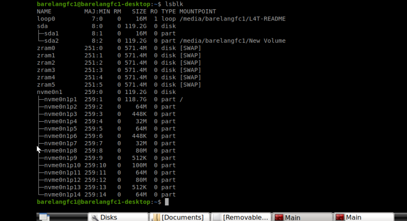
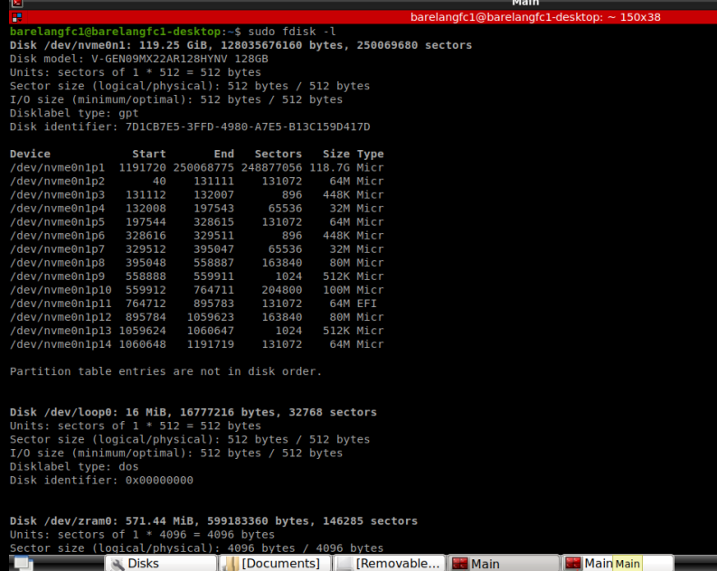
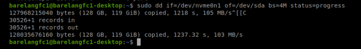
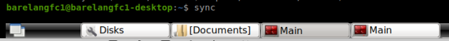
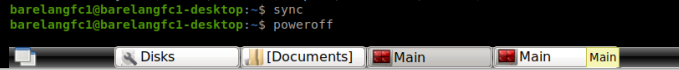

# Tutorial Cloning SSD pada Robot dengan NVDIA Jetson Xavier NX

Tutorial ini akan membimbing untuk menggandakan (clone) SSD pada robot berbasis **NVIDIA Jetson Xavier NX** dengan menggunakan perintah `dd` di Linux. Proses ini akan membuat salinan persis dari sistem, termasuk OS, konfigurasi, dan seluruh datanya.

---

## Langkah 1: Siapkan SSD Tujuan

1. Sambungkan SSD tujuan ke Jetson. Kamu bisa menggunakan **enclosure USB-to-SATA**.
    Sebelum SSD terdeteksi:
   

   Setelah SSD terdeteksi:
   

2. Cek apakah SSD tujuan sudah terbaca sistem dengan perintah:

   ```bash
   lsblk
   ```
   
   atau

   ```bash
   sudo fdisk -l
   ```
   

1. Catat path dari SSD **sumber** dan **tujuan**, contohnya:
   - SSD sumber: `/dev/sda`
   - SSD tujuan: `/dev/sdb`

---

## Langkah 2: Jalankan Proses Cloning

Setelah yakin path-nya benar, jalankan perintah berikut:

```bash
sudo dd if=/dev/sda of=/dev/sdb bs=4M status=progress
```

Penjelasan:
- `if=` adalah SSD sumber (input)
- `of=` adalah SSD tujuan (output)
- `bs=4M` untuk blok data 4MB
- `status=progress` menampilkan progres

Tampilan saat proses berlangsung:


Proses ini bisa memakan waktu tergantung kapasitas SSD.

---

## Langkah 3: Selesai! Saatnya Uji Hasil

1. Setelah proses selesai, jalankan:

   ```bash
   sync
   ```

   Ini memastikan semua data benar-benar tertulis ke SSD.
   

2. Lakukan shutdown:

   ```bash
   poweroff
   ```
   


3. Cabut SSD sumber, lalu nyalakan Jetson. Perangkat akan boot otomatis dari SSD tujuan yang telah dikloning.

---

## Catatan Penting

- SSD tujuan akan **100% identik** dengan SSD sumber.
- Pastikan path SSD **sumber dan tujuan** tidak tertukar! Kesalahan bisa menyebabkan data hilang atau tertimpa.
- Sebelum menjalankan `dd`, **selalu cek** lagi dengan `lsblk` atau `fdisk -l`.

---

## Referensi Tambahan

 📌 [Backup Linux dengan dd - GitHub](https://github.com/blackyboy/RedHat-Centos-Common-Stuffs/blob/master/6-Examples-to-Backup-Linux-Using-dd-Command-Including-Disk-to-Disk.md)  
 📌 [Disk Cloning dengan dd - ServerFault](https://serverfault.com/questions/4906/using-dd-for-disk-cloning)

---

Dokumentasi ini disusun untuk mempermudah proses duplikasi SSD secara **praktis, aman**, dan **langsung bisa dijalankan** di Jetson NVIDIA Xavier NX.